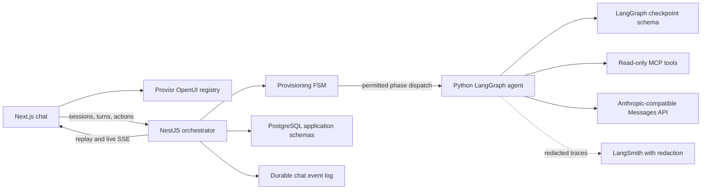
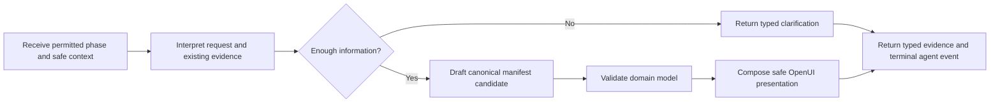

# Provisr Chat, OpenUI, SSE, and LangGraph Implementation Plan

**Status:** Proposed — rebased against the current repository
**Date:** 2026-08-02
**Vertical-slice boundary:** A policy- and context-informed, schema-valid manifest draft rendered in chat
**Primary layers:** Next.js frontend, NestJS orchestrator, Python LangGraph agent, MCP read-only tools, PostgreSQL
**Model integration:** Anthropic-compatible Messages API through a custom base URL and workspace header

## 1. Executive summary

This plan adds a durable conversational planning experience to the current Provisr control plane. It does not replace the existing provisioning workflow, state machine, audit model, or execution boundaries.

The first vertical slice ends when Provisr has produced and persisted a validated canonical manifest draft. Terraform generation, planning, confirmation, approval, execution, and reconciliation remain outside this slice.

```text
User submits a normal chat or infrastructure-planning turn
-> NestJS orchestrator authenticates, authorizes, and persists the turn
-> orchestrator creates a provisioning run only when infrastructure planning is required
-> existing FSM enforces policy and cloud context before manifest drafting
-> Python LangGraph agent performs bounded reasoning for the permitted phase
-> agent returns typed evidence, clarification, or a manifest candidate
-> orchestrator validates the response and controls every FSM transition
-> presentation stage creates validated OpenUI Lang plus safe fallback text
-> orchestrator persists ordered events before publication
-> frontend consumes resumable SSE and renders through the Provisr OpenUI registry
-> provisioning run stops at manifest_ready for this vertical slice
```

The central ownership rule is:

> LangGraph owns reasoning state. The NestJS finite state machine owns provisioning state.

## 2. Decisions confirmed for this plan

### 2.1 Vertical-slice boundary

- The first slice ends at a validated, persisted manifest draft.
- The stable provisioning state for the completed slice is `manifest_ready`.
- The orchestrator must not automatically advance a manifest-only run into IaC generation.
- Terraform generation, plan creation, confirmation, approval, execution, and cloud-state synchronization are later slices.
- The agent never executes IaC.

### 2.2 Conversation model

- A chat session may contain ordinary questions, clarifications, explanations, and multiple infrastructure-planning requests.
- Not every chat turn creates a provisioning run.
- `chat_turns.provisioning_run_id` is nullable.
- A turn that starts infrastructure planning is linked to exactly one authoritative `provisioning_run` for this slice.
- Chat records support presentation and history; they do not form a second provisioning state machine.

### 2.3 Workflow authority

- Keep the existing NestJS run FSM, transition validation, evidence gates, optimistic state versioning, audit records, and execution guard.
- Preserve the current order required by `CONTRACTS.md`:

```text
received
-> pending_policy              when workspace policies are enabled
-> pending_cloud_context
-> pending_agent
-> manifest_ready
```

- `get_policy_requirements` must succeed before policy-enabled planning.
- `get_cloud_account_capabilities` and `get_existing_resources` must succeed before manifest drafting.
- LangGraph cannot advance a provisioning run. It returns typed evidence to the orchestrator, which validates and advances the FSM.

### 2.4 Model provider

- Support only an Anthropic-compatible Messages API in this implementation.
- Use `ChatAnthropic` or a thin adapter over the Anthropic Messages API.
- Configure it with a custom base URL and a configurable workspace header.
- Do not use the separate Amazon Bedrock Anthropic client.
- Do not add Gemini to this slice.
- Keep model construction outside graph nodes so the transport can be replaced without rewriting the graph.

Required logical settings:

- `ANTHROPIC_API_KEY`
- `ANTHROPIC_BASE_URL`
- `ANTHROPIC_MODEL`
- `ANTHROPIC_WORKSPACE_ID`
- `ANTHROPIC_WORKSPACE_HEADER` when the compatible endpoint requires a nonstandard header name

No secret value or sensitive header may appear in logs, SSE events, audit payloads, OpenUI output, or LangSmith traces.

### 2.5 OpenUI

- Keep the existing Provisr chat screen rather than adopting a prebuilt chat shell.
- Use `@openuidev/react-lang` and `@openuidev/lang-core`.
- Render assistant messages through a custom Provisr component library.
- Persist safe fallback text with every assistant message.
- Use deterministic composition for plain text, status, clarification, validation errors, policy results, and known manifest summaries.
- Permit model-assisted composition only when a variable layout provides real value; validate the result before exposing it.
- Never render model HTML, execute model JavaScript, or dynamically import a component named by the model.

### 2.6 Initial component subset

The first slice implements this smaller set and maps it to the existing FE-C backlog:

| Runtime component | Backlog alignment | Purpose |
|---|---|---|
| `AssistantResponse` | FE-C02 | Required root for ordered assistant content |
| `ProvisrText` | FE-C02 | Safe text, explanation, and fallback rendering |
| `AgentStatus` | FE-C20 | Current policy, context, planning, or validation phase |
| `ClarificationQuestion` | FE-C03 | Typed question and answer controls |
| `ArchitectureSummary` | FE-C04 | Provider, environment, assumptions, and proposed architecture |
| `ResourceTable` | FE-C13 | Manifest resources and dependencies |
| `CostEstimate` | FE-C14 | Optional estimate and assumptions when evidence exists |
| `PolicyResult` | FE-C15 | Policy requirements, decisions, and references |
| `SecurityWarning` | FE-C16 | Prominent security and unresolved-risk presentation |
| `ExecutionTimeline` | FE-C20 | For this slice, progress only through `manifest_ready` |

Compute, container, networking, database, storage, Terraform, approval, execution, cloud-state, drift, and artifact-specific components remain in the canonical FE-C backlog and are added incrementally in later slices.

## 3. Current repository baseline

The implementation must extend the current code rather than assume an empty system.

### 3.1 Existing capabilities to retain

- PostgreSQL already contains `provisr_state.chat_sessions` and `provisr_state.provisioning_runs`.
- Provisioning runs already include state, state version, idempotency key, correlation ID, policy decision, approval status, execution status, and terminal error fields.
- Existing migrations add clarification state through `awaiting_user_input` and `pending_question`.
- The orchestrator already exposes session creation, run creation, run retrieval, clarification resume, and confirmation routes.
- The orchestrator already enforces run transitions and evidence requirements.
- Run creation and transitions already write audit and outbox records transactionally.
- Clerk authentication, workspace membership checks, and workspace scoping already exist.
- The frontend already creates sessions and runs, resumes questions, confirms runs, and polls run state.
- The agent already contains Anthropic-compatible configuration and a direct model implementation, but its active entrypoint and API contract are not consolidated.

### 3.2 Gaps this plan addresses

- The frontend still contains static demonstration content and polling rather than durable chat history and SSE.
- The composer and the separate run-flow panel are not yet one coherent chat experience.
- There is no persisted `chat_turns` or `chat_messages` model.
- The current `provisr_events.sse_events` table behaves as a delivery outbox and does not provide complete per-session replay semantics.
- There is no orchestrator-owned replay/live SSE endpoint.
- The frontend component registry described by repository instructions is not implemented.
- The active agent development and Docker entrypoint exposes only health routes, while a separate `agent/app` implementation contains a different session API.
- The orchestrator expects `POST /runs/:run_id/dispatch`, but the deployed agent entrypoint does not implement it.
- The current agent lifecycle is synchronous and does not provide LangGraph checkpoints or durable interrupts.
- LangGraph, LangChain Anthropic, PostgreSQL checkpointing, and LangSmith are not declared consistently in the agent manifest.

## 4. Target architecture



### 4.1 Responsibility boundaries

| Concern | Owner |
|---|---|
| Chat layout and transient interaction state | Frontend |
| Component implementations and safe rendering | Frontend registry |
| Public authentication and workspace authorization | Orchestrator |
| Chat sessions, turns, messages, and public actions | Orchestrator |
| Provisioning state and legal transitions | Existing orchestrator FSM |
| Event order, replay, publication, and cancellation mutation | Orchestrator |
| Reasoning, clarification, and manifest candidate generation | LangGraph agent |
| Policy and cloud-context results | MCP/backend service boundaries |
| Canonical persisted manifest | Existing manifest schema/repository |
| Graph checkpoints | LangGraph PostgreSQL schema |
| Diagnostic traces | LangSmith, with redaction |

## 5. Identity and lifecycle model

| Identifier | Meaning | Owner |
|---|---|---|
| `session_id` | Conversation containing many turns and possibly many provisioning runs | Orchestrator |
| `turn_id` | One user input and its resulting assistant work | Orchestrator |
| `message_id` | Persisted user, assistant, or system message | Orchestrator |
| `client_message_id` | Frontend-generated retry/deduplication identity | Frontend |
| `provisioning_run_id` | Existing governed infrastructure workflow; nullable on ordinary chat turns | Orchestrator FSM |
| `agent_run_id` | One agent attempt for a turn or provisioning phase | Orchestrator |
| `langgraph_thread_id` | Checkpoint thread: provisioning run ID, otherwise turn ID | Orchestrator/agent contract |
| `checkpoint_id` | LangGraph checkpoint | LangGraph |
| `event_id` | Stable public stream event identifier | Orchestrator |
| `sequence` | Monotonic per-session replay cursor | PostgreSQL |
| `correlation_id` | Cross-layer trace key | Orchestrator |
| `provider_message_id` | Messages API response correlation | Model adapter |
| `ui_registry_version` | Component contract version | Registry build |
| `prompt_bundle_hash` | Exact composed prompt bundle | Prompt registry |

### 5.1 LangGraph thread rule

- For a turn linked to infrastructure planning, use `provisioning_run_id` as `configurable.thread_id`.
- For a normal chat turn, use `turn_id` as `configurable.thread_id`.
- Load conversation history from persisted `chat_messages`; do not rely on one shared LangGraph thread for the entire chat session.
- Record the thread and latest checkpoint identifiers on `agent_runs` for recovery and diagnostics.

This prevents checkpoints from separate provisioning attempts in the same conversation from interfering with each other.

## 6. Persistence design

PostgreSQL remains the source of truth. Extend the existing schemas through additive migrations.

### 6.1 Existing tables retained

- `provisr_state.chat_sessions`
- `provisr_state.provisioning_runs`
- `provisr_manifest.manifests`
- `provisr_audit.audit_events`
- Existing event/outbox tables

Do not recreate or shadow these tables.

### 6.2 New application records

| Table | Important fields | Purpose |
|---|---|---|
| `chat_turns` | `id`, `session_id`, nullable `provisioning_run_id`, `client_message_id`, `kind`, `status`, timestamps | One ordinary chat, UI action, or planning turn |
| `chat_messages` | `id`, `session_id`, `turn_id`, nullable `provisioning_run_id`, `role`, `content`, `ui_document`, `fallback_text`, registry metadata, timestamps | Canonical replayable history |
| `agent_runs` | `id`, `turn_id`, nullable `provisioning_run_id`, `phase`, `langgraph_thread_id`, `checkpoint_id`, `status`, model/trace metadata, timestamps | Agent attempt and recovery correlation |

Rules:

- Add a unique constraint on `(session_id, client_message_id)`.
- Scope reads and writes by authenticated workspace membership.
- Preserve the existing provisioning-run idempotency key while migrating toward a scoped constraint rather than an unrelated global duplicate system.
- Store final assistant messages as canonical history.
- Treat token/UI deltas as transport events that may be compacted after completion.
- Apply retention rules independently to messages, stream events, checkpoints, and traces.

### 6.3 Outbox versus replay log

Do not make one table serve two incompatible purposes.

1. **Transactional outbox:** internal delivery state such as pending, sent, failed, and retry metadata.
2. **Chat event log:** immutable, ordered, client-visible events used for SSE replay.

The chat event log requires:

- `event_id`
- `session_id`
- nullable `turn_id`
- nullable `provisioning_run_id`
- monotonically increasing per-session `sequence`
- `event_type`
- schema version
- timestamp
- correlation ID
- validated payload

Persist the application mutation, audit record, outbox entry, and required client event in one database transaction whenever they represent the same state change.

### 6.4 LangGraph checkpoints

- Use `langgraph-checkpoint-postgres` with `AsyncPostgresSaver`.
- Keep checkpoint tables in a separate schema and use a least-privilege database role.
- Run the checkpointer setup through an explicit migration/setup job, never on every application request.
- Store only workspace-safe state. Do not checkpoint credentials, raw approval tokens, connection strings, or unredacted tool output.

## 7. Public orchestrator API

Preserve existing routes and add chat behavior without creating a competing control plane.

### 7.1 Existing routes retained

| Method and path | Role |
|---|---|
| `POST /workspaces/:workspaceId/sessions` | Create a chat session |
| `POST /sessions/:sessionId/runs` | Compatibility route for starting a provisioning run |
| `GET /runs/:runId` | Retrieve authoritative provisioning state |
| `POST /runs/:runId/resume` | Resume a validated clarification |
| `POST /runs/:runId/confirm` | Retained for later full-workflow slices |

### 7.2 Additive chat routes

| Method and path | Purpose |
|---|---|
| `GET /sessions/:sessionId/messages` | Hydrate or paginate persisted chat history |
| `POST /sessions/:sessionId/turns` | Submit normal text, planning text, or a typed UI action |
| `GET /sessions/:sessionId/events` | Open or resume the orchestrator-owned SSE stream |
| `POST /turns/:turnId/cancel` | Request idempotent cooperative cancellation |

The orchestrator determines whether a text turn is conversational or starts a provisioning run. The client may provide intent as a hint, but it cannot bypass run creation or FSM gates.

Example text turn:

```json
{
  "client_message_id": "uuid",
  "input": {
    "kind": "text",
    "text": "Create a production web service on AWS"
  },
  "ui_registry_version": "provisr-ui-v1"
}
```

Example typed clarification action:

```json
{
  "client_message_id": "uuid",
  "input": {
    "kind": "ui_action",
    "action": {
      "type": "clarification.answer",
      "component_id": "database-engine-question",
      "provisioning_run_id": "uuid",
      "payload": {
        "answer": "postgresql"
      }
    }
  },
  "ui_registry_version": "provisr-ui-v1"
}
```

Every mutation requires the repository-standard idempotency header. `client_message_id` is the domain-level deduplication identity; the HTTP idempotency key protects the mutation itself.

## 8. SSE protocol

### 8.1 Envelope

```text
id: 1842
event: assistant.ui.delta
data: {"v":1,"session_id":"...","turn_id":"...","provisioning_run_id":"...","sequence":1842,"timestamp":"...","correlation_id":"...","payload":{...}}
```

Unknown event types must be ignored safely by older clients.

### 8.2 Initial event catalogue

| Event | Meaning |
|---|---|
| `stream.ready` | Connection established with resume metadata |
| `turn.accepted` | Chat turn was durably created |
| `run.created` | Turn created an authoritative provisioning run |
| `run.state_changed` | Existing FSM state changed |
| `agent.status` | Safe reasoning phase/status update |
| `assistant.ui.started` | Assistant OpenUI document began |
| `assistant.ui.delta` | Incremental OpenUI Lang fragment |
| `assistant.ui.completed` | Valid final document and fallback text persisted |
| `clarification.required` | Run is waiting for validated user input |
| `manifest.validated` | Canonical manifest passed schema validation |
| `turn.completed` | Turn completed successfully |
| `turn.failed` | Turn reached a structured failure |
| `turn.cancelled` | Cooperative cancellation completed |
| `heartbeat` | Connection liveness signal |

### 8.3 Ordering and recovery

- Persist each event before publishing it.
- Allocate sequence numbers transactionally per session.
- Accept `Last-Event-ID` and an `after` query parameter.
- Replay events with a higher sequence, then attach to the live publisher without a gap.
- Make frontend reducers idempotent so duplicate frames are harmless.
- Send a heartbeat approximately every 15 seconds.
- Use bounded live queues; a slow consumer reconnects and recovers from the durable log.
- Use a fetch-based SSE client so Clerk authorization headers and abort signals are supported.

## 9. Frontend implementation

Retain the current chat design, sidebar, composer, navigation, and review surface. Replace the static demonstration path and polling panel with one session-oriented chat feature.

Target structure:

```text
frontend/
  components/registry/
    registry.ts
    actions.ts
    fallback.tsx
    components/*.tsx
  features/chat/
    api/chat-client.ts
    api/sse-client.ts
    contracts/chat-events.ts
    hooks/use-chat-session.ts
    state/chat-reducer.ts
    components/assistant-message.tsx
    components/message-composer.tsx
    components/connection-state.tsx
```

The session hook owns:

- History hydration
- Turn submission
- SSE connection and replay cursor
- Reconnection
- Clarification actions
- Cancellation
- One active agent turn per session for the first slice

The reducer keeps durable server state separate from transient input, scroll, focus, and connection state.

Assistant rendering follows one safe boundary:

```tsx
<Renderer
  response={message.uiDocument}
  library={provisrLibrary}
  isStreaming={message.status === "streaming"}
  onAction={(action) => submitValidatedAction(message, action)}
  onError={() => showStoredFallback(message)}
/>
```

If the OpenUI document is missing, partial, invalid, unsupported, or fails to render, display the stored fallback through `ProvisrText`.

## 10. Registry and contract source of truth

Avoid introducing an unregistered parallel workspace package during the first slice.

- Put cross-layer UI payload and action schemas in `packages/shared-contracts`.
- Keep runtime component registration at `frontend/components/registry/registry.ts`, matching repository instructions.
- Generate a non-executable OpenUI prompt/schema artifact for the Python agent from the shared schemas and frontend definitions.
- Store generated artifacts under a documented generated directory and verify that generation is deterministic.
- Record registry version and content hash on assistant messages and agent runs.
- Update `CONTRACTS.md` with the public chat, SSE, UI document, action, and internal agent-event contracts.

The Python agent consumes component names, descriptions, props, examples, allowed nesting, actions, registry version, and hash. It never imports or executes React code.

## 11. Orchestrator implementation

Extend the current runs and services modules rather than creating a second orchestration stack.

Suggested additions:

```text
orchestrator/src/chat/
  chat.module.ts
  chat.controller.ts
  chat.service.ts
  chat.repository.ts
  message.repository.ts
  chat-event.repository.ts
  chat-stream.service.ts
  chat-contracts.ts
  ui-action.validator.ts
```

Integrate these with the existing:

- `RunsService`
- `DispatchService`
- `AgentClient`
- State-machine transitions and evidence checks
- `AuditService`
- Outbox behavior
- Clerk/workspace authorization

### 11.1 Manifest-only run behavior

Add an explicit run scope or capability such as `manifest_only`. For such a run:

- The legal FSM path still ends at `manifest_ready` after required evidence.
- Reaching `manifest_ready` does not automatically transition to `pending_iac`.
- The run remains inspectable and resumable by a future, separately authorized continuation feature.
- The UI presents the manifest as a draft, never as deployed infrastructure.

This is an intentional stop at an existing state, not a skipped policy or execution gate.

### 11.2 Agent boundary

Keep the current phase-aware internal dispatch contract for provisioning work:

```text
POST /runs/:run_id/dispatch
```

Add a turn-scoped internal dispatch only for ordinary chat when required:

```text
POST /turns/:turn_id/dispatch
```

Both endpoints must call the same internal agent application service and emit the same typed internal event format. They must not create separate agent implementations.

## 12. Agent consolidation and LangGraph design

### 12.1 Consolidate the package first

Before adding LangGraph:

- Choose one importable Python package and one FastAPI entrypoint.
- Remove the split between a health-only deployed entrypoint and a separate legacy session API.
- Implement the orchestrator's existing `/runs/:run_id/dispatch` contract.
- Keep health, readiness, configuration, and tests on the same application instance.
- Reconcile `agent/pyproject.toml` and `agent/uv.lock` so declared and locked dependencies agree.

### 12.2 Graph responsibility

The graph is a bounded reasoning workflow, not the provisioning FSM.



Graph state includes:

- Session, turn, provisioning-run, and agent-run IDs
- Current orchestrator-permitted phase
- Safe conversation history
- Policy evidence
- Cloud capability and inventory summaries
- Missing information and clarification state
- Planner decision
- Manifest candidate and validation results
- OpenUI document and fallback text
- Registry version and prompt hash
- Cancellation and sanitized error state

### 12.3 Streaming

- Use LangGraph async streaming modes appropriate for messages, updates, and custom events.
- Never stream private chain-of-thought or planner reasoning.
- Convert node transitions into concise `agent.status` events.
- Stream only presentation-stage OpenUI fragments.
- Return a typed terminal internal event for success, clarification, cancellation, or failure.
- The orchestrator validates, persists, and translates internal events into the public SSE contract.

### 12.4 Clarification and cancellation

- A clarification checkpoints the graph and returns a typed question.
- The orchestrator validates the answer against the question contract and current run state.
- Resume uses the same graph thread for that turn/run.
- Cancellation is an idempotent orchestrator mutation.
- The orchestrator records intent, aborts the active agent request, and the graph checks cancellation between expensive operations.
- Terminal status is settled transactionally to prevent cancellation/completion races.

## 13. Anthropic-compatible Messages API

Create one model factory with separate logical profiles:

1. **Planner profile:** low temperature, strict structured output, no public token streaming.
2. **Presenter profile:** concise generation and streaming for validated OpenUI output when deterministic composition is insufficient.

The factory must:

- Use the configured Anthropic-compatible base URL.
- Send the configured workspace header without hard-coding secret values.
- Use the Messages API semantics expected by the compatible endpoint.
- Avoid Bedrock-specific clients, credentials, and request formats.
- Validate configuration at startup.
- Apply timeouts and bounded retries.
- Capture safe model name, response ID, latency, and usage metadata.
- Convert provider errors into stable internal error codes without leaking headers or response bodies.

Before graph integration, add capability tests for:

- Authentication
- Model availability
- Async streaming
- Structured output behavior
- Custom workspace header
- Rate-limit and timeout error shapes

## 14. Policy and cloud-context tools

Real context integration occurs before real manifest generation.

| Tool | Required phase | Safe result |
|---|---|---|
| `get_policy_requirements` | `pending_policy` when enabled | Summarized constraints and rule references |
| `get_cloud_account_capabilities` | `pending_cloud_context` | Connected-account capabilities, regions, supported services, safe quotas |
| `get_existing_resources` | `pending_cloud_context` | Normalized inventory summaries without credentials or secrets |

The orchestrator supplies the required MCP context envelope. Tool calls use workspace-scoped service authorization, timeouts, size limits, provenance, audit records, and stable error codes.

No create, update, delete, approve, execute, or raw-credential tool is available to the agent in this slice.

## 15. Prompt registry and first manifest slice

### 15.1 Prompt modules

```text
agent/prompts/
  core/
    identity.md
    safety.md
    strict-flow.md
  providers/aws/
    conventions.md
  domains/
    compute/ecs.md
    networking/alb.md
    data/rds-postgresql.md
    observability/cloudwatch.md
  solutions/
    aws-web-service.yaml
  ui/
    openui-generated.txt
```

Each module declares an ID, semantic version, applicability, dependencies, allowed tools, required evidence, schema references, and content hash.

Build two bundles:

- **Planner bundle:** core safety, current permitted phase, policy/cloud evidence, provider/domain modules, and the canonical manifest schema.
- **Presenter bundle:** generated OpenUI registry contract and only the validated structured result required for presentation.

Persist selected module versions and the final bundle hash on `agent_runs`.

### 15.2 AWS reference solution

The first real planning fixture is:

```text
AWS
-> ECS service
-> Application Load Balancer
-> RDS PostgreSQL
-> CloudWatch
```

The agent drafts a provider-neutral Provisr manifest with provider-specific resource details. It must include schema version, environment, provider decision provenance, region/account context, resources, dependencies, security settings, policy references, assumptions, source metadata, and confidence for inferred values.

The canonical schema remains in the repository's shared contract source of truth. The agent may propose a candidate; the orchestrator and domain validators decide whether it is valid enough to persist and enter `manifest_ready`.

No Terraform is generated in this slice.

## 16. LangSmith observability and privacy

LangSmith is optional diagnostic telemetry, never product persistence.

- Separate local, preview, staging, and production projects.
- Send only safe metadata such as environment, graph/node name, agent run ID, hashed workspace identity, registry version, prompt hash, model, latency, usage, and outcome.
- Hide model and tool inputs/outputs by default outside local development.
- Apply allowlist-based redaction before any diagnostic content export.
- Never export credentials, connection strings, workspace headers, raw policy bundles, approval tokens, or unredacted cloud inventory.
- Keep tracing failures non-fatal.
- Define sampling and retention separately from application-data retention.

## 17. Security and trust boundaries

1. Authenticate and authorize every public request.
2. Scope every session, turn, message, run, action, event replay, and tool call to the workspace.
3. Validate HTTP, SSE, agent, tool, manifest, and OpenUI payloads at their boundaries.
4. Treat model output as untrusted until schema validation succeeds.
5. Never expose infrastructure tools through a browser-side OpenUI tool provider.
6. Never render model HTML or execute model-supplied code.
7. Require idempotency keys for every mutation.
8. Audit every provisioning state transition and security-relevant chat action.
9. Redact secrets from logs, traces, events, errors, and fallback content.
10. Enforce payload, event replay, queue, model, tool, and concurrency limits.
11. Preserve policy-before-manifest ordering.
12. Keep IaC generation and execution outside the agent and outside this slice.

## 18. Failure and recovery behavior

| Failure | User-visible behavior | Recovery |
|---|---|---|
| SSE disconnect | Reconnecting state without duplicated content | Resume after last sequence |
| Browser refresh | Persisted history and current run state | Hydrate and reopen SSE |
| Duplicate submission | Existing turn returned | Scoped idempotency lookup |
| Invalid OpenUI delta/document | Stored safe fallback | Record diagnostic; do not execute anything |
| Agent timeout | Concise retryable failure | Persist attempt failure; permit safe retry |
| Messages API rate limit | Retry guidance without provider internals | Bounded server retry with jitter |
| Policy/context failure | Explain unavailable evidence; no manifest | Retry safely or clarify |
| Orchestrator restart | Accepted turns and events remain | Reconcile nonterminal turns/runs |
| Clarification restart | Question remains answerable | Resume persisted graph checkpoint |
| Cancellation race | One terminal result | Transactional compare/update |
| LangSmith outage | No user-facing failure | Drop/defer telemetry |

## 19. Testing strategy

### 19.1 Contract tests

- Validate public turn, message, action, SSE, and internal agent-event schemas.
- Snapshot representative SSE frames.
- Verify registry version/hash compatibility.
- Verify unknown events and components fail safely.
- Verify TypeScript and Python fixtures remain compatible.

### 19.2 Frontend tests

- History hydration and one-active-turn behavior.
- Sequence ordering, duplicate suppression, replay, and reconnect.
- Cancellation and recoverable failure states.
- Rendering tests for the initial component subset.
- Malformed, partial, and unsupported OpenUI fallback behavior.
- Typed clarification actions route only through the orchestrator.
- Keyboard operation, focus, labels, live announcements, contrast, and reduced motion.

### 19.3 Orchestrator tests

- Session ownership and workspace authorization.
- General chat turns do not create provisioning runs unnecessarily.
- Planning turns link to exactly one authoritative provisioning run.
- Turn and provisioning-run idempotency semantics.
- Transactional event sequence allocation.
- Replay/live handoff without a gap.
- Existing FSM evidence gates remain enforced.
- Manifest-only runs stop at `manifest_ready`.
- Invalid actions and forged run references are rejected.
- Restart reconciliation and cancellation races.

### 19.4 Agent tests

- One consolidated entrypoint exposes health and dispatch routes.
- Orchestrator dispatch envelopes validate in Python.
- Prompt selection, ordering, versions, and deterministic hashes.
- Planner structured-output validation.
- No manifest without required policy/cloud evidence.
- Clarification checkpoint and resume.
- Presentation output validates against the registry.
- Private reasoning never appears in public events.
- Custom Messages API base URL and workspace header behavior.
- Sanitized model and tool failures.

### 19.5 End-to-end scenarios

1. Ordinary question completes without creating a provisioning run.
2. Infrastructure request creates a turn and linked provisioning run.
3. Policy and cloud context are loaded before manifest drafting.
4. Clarification survives refresh and resumes the same run/thread.
5. OpenUI architecture and resource summary stream progressively.
6. Disconnect and reconnect completes exactly once.
7. Invalid UI output falls back safely.
8. Cancellation produces one terminal status.
9. Policy/context failure produces no manifest.
10. Valid manifest persists and the run stops at `manifest_ready`.
11. Cross-workspace session, event, and run access fails closed.

## 20. Phased implementation plan

Every phase must keep the repository runnable and use the required RFC/design-discussion workflow.

### Phase 0 — Baseline, RFC, and contract freeze

Work:

- Open the design-discussion RFC.
- Record current build/test blockers separately from feature regressions.
- Confirm additive compatibility for existing session/run routes.
- Document chat-turn versus provisioning-run ownership.
- Define `manifest_only` run behavior and the stop at `manifest_ready`.
- Update the contract plan for identifiers, idempotency, registry versions, retention, and cancellation.

Acceptance:

- One reviewed architecture describes both normal chat and governed planning.
- The NestJS FSM remains the only provisioning workflow authority.
- No code path can bypass policy/context evidence.

### Phase 1 — Consolidate the Python agent

Work:

- Select one Python package and FastAPI entrypoint.
- Implement the existing run dispatch contract.
- Remove or migrate the competing legacy session API.
- Reconcile declared and locked dependencies.
- Preserve safe Anthropic-compatible configuration; remove Gemini from the slice.

Acceptance:

- The development script, Docker image, tests, and orchestrator all target the same agent app.
- A deterministic dispatch fixture passes end to end.

### Phase 2 — Extend chat persistence

Work:

- Add turns, messages, agent attempts, and their indexes/constraints.
- Link planning turns optionally to existing provisioning runs.
- Separate client replay events from outbox delivery state.
- Add cleanup and retention policies.

Acceptance:

- Ordinary chat persists without a provisioning run.
- Planning turns retain their authoritative run relationship.
- Duplicate client message IDs return the original turn.

### Phase 3 — Orchestrator-owned SSE

Work:

- Implement the versioned event envelope and catalogue.
- Add transactional per-session sequencing.
- Add replay, live handoff, heartbeat, bounded queues, and cancellation.
- Translate existing run state changes into public chat events.

Acceptance:

- A client can submit, disconnect, reconnect, and complete without lost or duplicated visible state.
- All frames validate against shared contracts.

### Phase 4 — Frontend chat transport

Work:

- Replace polling and static demonstration responses with history hydration and fetch-based SSE.
- Integrate composer, messages, run progress, clarification, retry, connection state, and Stop.
- Enforce one active agent turn per session.

Acceptance:

- Normal chat and mock planning work in the existing screen.
- Browser refresh restores history and current progress.
- The browser cannot call agent or MCP services directly.

### Phase 5 — OpenUI registry subset

Work:

- Install OpenUI dependencies.
- Add shared payload/action schemas.
- Implement the ten initial runtime components.
- Generate the agent-facing registry prompt/schema artifact and hash.
- Add fallback and typed action handling.

Acceptance:

- Initial fixtures render safely and accessibly.
- Invalid documents always display stored fallback text.
- Components map explicitly to the FE-C backlog.

### Phase 6 — Minimal LangGraph runtime

Work:

- Add typed graph state and deterministic planner/presenter nodes.
- Add internal typed event streaming.
- Add PostgreSQL checkpoint integration behind a test configuration.
- Keep the graph bounded by the orchestrator-permitted phase.

Acceptance:

- The public SSE contract is unchanged when switching from deterministic dispatch to LangGraph.
- The graph cannot advance provisioning state.

### Phase 7 — Policy and cloud context

Work:

- Connect the three required read-only tools through existing MCP boundaries.
- Add context validation, audit, provenance, timeouts, redaction, and size limits.
- Return evidence in the current orchestrator dispatch envelope.

Acceptance:

- The existing FSM rejects manifest drafting without required evidence.
- No mutation or execution tool is available to the graph.

### Phase 8 — Anthropic-compatible model integration

Work:

- Implement planner and presenter profiles against the custom Messages API endpoint.
- Add workspace-header support, structured output, streaming, timeouts, bounded retries, and safe usage metadata.
- Filter private reasoning from public streams.

Acceptance:

- Authentication, custom base URL, workspace header, structured planning, and streaming pass capability tests.
- No Bedrock client or Gemini path is used.
- Credentials and sensitive headers are absent from logs and events.

### Phase 9 — Checkpointed clarification and cancellation

Work:

- Finalize `AsyncPostgresSaver` setup and schema ownership.
- Implement clarification interrupt/resume and cooperative cancellation.
- Add restart recovery tests.

Acceptance:

- Clarification survives agent and orchestrator restart.
- Cancellation settles exactly once.

### Phase 10 — AWS manifest slice

Work:

- Add versioned ECS, ALB, RDS PostgreSQL, CloudWatch, and solution prompt modules.
- Define the canonical manifest fixture and validation rules.
- Produce deterministic architecture/resource/policy presentation where possible.
- Persist the validated manifest through the existing manifest repository.
- Stop the run at `manifest_ready`.

Acceptance:

- The agent produces a policy- and context-informed, schema-valid manifest draft for the AWS reference solution.
- The UI renders the draft and its assumptions safely.
- No Terraform, confirmation, approval, or execution occurs.

### Phase 11 — LangSmith with redaction

Work:

- Add environment-specific projects, safe metadata, input/output hiding, redaction, sampling, and non-fatal failure behavior.

Acceptance:

- Traces correlate graph and model activity without prohibited data.
- Disabling or losing LangSmith does not affect chat completion.

## 21. Configuration inventory

| Area | Settings |
|---|---|
| Application database | Existing PostgreSQL URL, pool sizes, SSL mode |
| Checkpoint database | PostgreSQL URL/schema/role and encryption policy |
| Agent endpoint | Private base URL, service authentication, connect/read timeouts |
| Anthropic-compatible API | API key, base URL, model, workspace ID/header, timeout/retry limits |
| LangSmith | Enabled flag, endpoint, API key, project/environment, sampling, redaction mode |
| OpenUI | Registry version/hash and maximum document/delta/action sizes |
| SSE | Heartbeat, replay limit, live queue bound, retention period |
| Runtime | One-active-turn rule, manifest-only scope, cancellation grace, concurrency limits |
| Feature flags | Mock agent, LangGraph, OpenUI rendering, LangSmith, read-only tools |

Validate required settings at startup. Health and readiness endpoints expose only safe status and never return secret-bearing configuration.

## 22. Definition of done

The vertical slice is complete when:

1. A user can hold a normal conversation without creating a provisioning run.
2. An infrastructure request creates a chat turn linked to an existing governed provisioning run.
3. Policy and cloud context are collected in the required order.
4. Clarifications are typed, persisted, and resumable.
5. The LangGraph agent produces a schema-valid manifest candidate without owning FSM transitions.
6. The orchestrator validates and persists the manifest and moves the run to `manifest_ready`.
7. The run stops at `manifest_ready`; no IaC or execution path is invoked.
8. Assistant output streams through durable, resumable orchestrator-owned SSE.
9. The frontend renders the initial OpenUI component subset with safe fallback behavior.
10. Authentication, workspace isolation, idempotency, audit, cancellation, and redaction tests pass.
